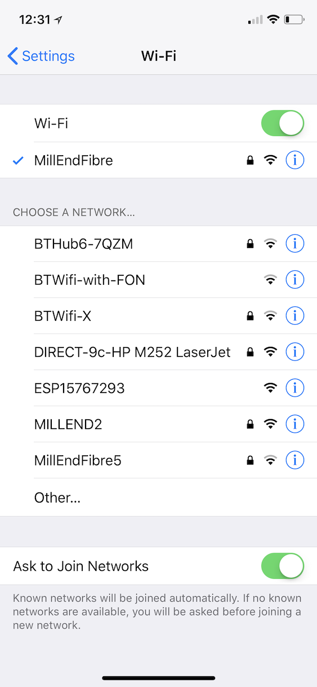
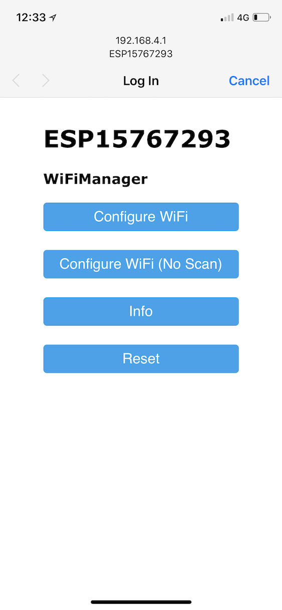
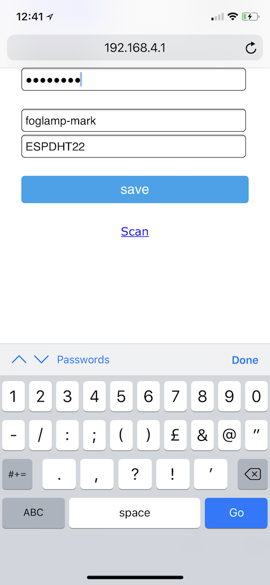

.. |br| raw:: html

    

.. Images

*****
Setup
*****

To perform the initial setup of the ESP8266 FogLAMP South Microservice or to modify a device that has already been setup we simply use an external device that conects to the WiFi hotspot that is created by the ESP8266 when it is first powered on or reset. This makes use of the WiFi Manager mechanism by which WiFi networks can force a newly connected user to login in order to use a network.

To configure your device use a phone, tablet or computer and look for a WiFi network with an SSID of the form ESPxxxxxxxx and connect to it. |foglamp_wifis| |br| |br|

Once connected a configuration popup should appear, if this popup does not appear then use a web browser to navigate to the url http://192.168.4.1/. |foglamp_menu| |br| |br|

Select either the ``Configure WiFi`` or ``Configure WiFi (No Scan)``. Use the later if the WiFi you wish your device to connect to is not browsable. |foglamp_scan| |br| |br|

Select or enter your desired network SSID and assciated password. |br| |br|

The third field contains the name of the FogLAMP to which you wish to connect. Set this name to the name you assigned your FogLAMP or set it to * to connect to the first available FogLAMP core service. |br| |br|

The final field is the asset name to use when adding reading data to FogLAMP. Set this to the alphanumeric string that you wish your asset to appear as in your PI server. |foglamp_asset| |br| |br|

Finally disconnect from the WiFi of the ESP8266 device.

Your ESP8266 should now connect to FogLAMP and start to send readings. These settings will be retained in the NVRam of the ESP8266 and will not need to be reset following power failure or after a reset. Should you wish to change the setup of your ESP8266 simply reset the device and connect to its local WiFi network and repeat the above procedure.
